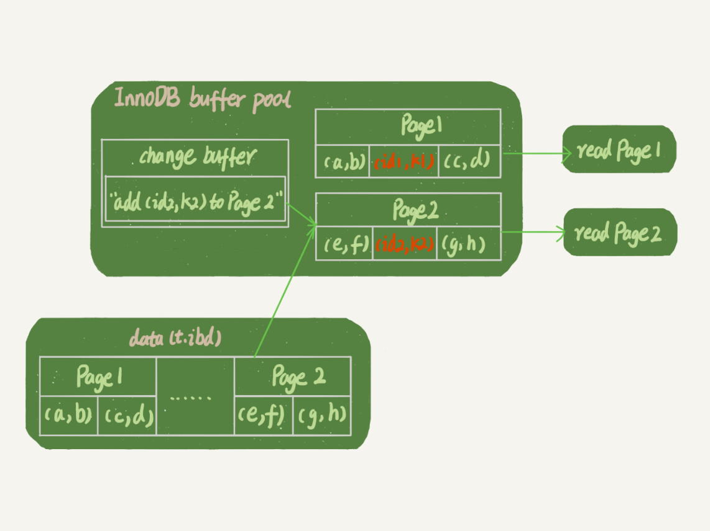

<!-- START doctoc generated TOC please keep comment here to allow auto update -->
<!-- DON'T EDIT THIS SECTION, INSTEAD RE-RUN doctoc TO UPDATE -->
**Table of Contents**  *generated with [DocToc](https://github.com/thlorenz/doctoc)*

- [MySQL tips](#mysql-tips)
- [基础架构: 一条 SQL 命令的执行](#%E5%9F%BA%E7%A1%80%E6%9E%B6%E6%9E%84-%E4%B8%80%E6%9D%A1-sql-%E5%91%BD%E4%BB%A4%E7%9A%84%E6%89%A7%E8%A1%8C)
  - [命令执行的过程解析](#%E5%91%BD%E4%BB%A4%E6%89%A7%E8%A1%8C%E7%9A%84%E8%BF%87%E7%A8%8B%E8%A7%A3%E6%9E%90)
    - [连接器: 管理连接，身份认证和权限预取](#%E8%BF%9E%E6%8E%A5%E5%99%A8-%E7%AE%A1%E7%90%86%E8%BF%9E%E6%8E%A5%E8%BA%AB%E4%BB%BD%E8%AE%A4%E8%AF%81%E5%92%8C%E6%9D%83%E9%99%90%E9%A2%84%E5%8F%96)
      - [调试与配置](#%E8%B0%83%E8%AF%95%E4%B8%8E%E9%85%8D%E7%BD%AE)
      - [tips](#tips)
    - [查询缓存: 即将被取消的鸡肋模块](#%E6%9F%A5%E8%AF%A2%E7%BC%93%E5%AD%98-%E5%8D%B3%E5%B0%86%E8%A2%AB%E5%8F%96%E6%B6%88%E7%9A%84%E9%B8%A1%E8%82%8B%E6%A8%A1%E5%9D%97)
- [09 | 普通索引和唯一索引，应该怎么选择？](#09--%E6%99%AE%E9%80%9A%E7%B4%A2%E5%BC%95%E5%92%8C%E5%94%AF%E4%B8%80%E7%B4%A2%E5%BC%95%E5%BA%94%E8%AF%A5%E6%80%8E%E4%B9%88%E9%80%89%E6%8B%A9)
  - [查询过程](#%E6%9F%A5%E8%AF%A2%E8%BF%87%E7%A8%8B)
  - [更新过程](#%E6%9B%B4%E6%96%B0%E8%BF%87%E7%A8%8B)
    - [Change buffer: 缓存变更动作](#change-buffer-%E7%BC%93%E5%AD%98%E5%8F%98%E6%9B%B4%E5%8A%A8%E4%BD%9C)
      - [什么条件下可以使用ChangeBuffer呢？](#%E4%BB%80%E4%B9%88%E6%9D%A1%E4%BB%B6%E4%B8%8B%E5%8F%AF%E4%BB%A5%E4%BD%BF%E7%94%A8changebuffer%E5%91%A2)
      - [相关配置项`innodb_change_buffer_max_size`](#%E7%9B%B8%E5%85%B3%E9%85%8D%E7%BD%AE%E9%A1%B9innodb_change_buffer_max_size)
      - [ChangeBuffer使用场景](#changebuffer%E4%BD%BF%E7%94%A8%E5%9C%BA%E6%99%AF)
  - [唯一索引和普通索引在更新过程的不同](#%E5%94%AF%E4%B8%80%E7%B4%A2%E5%BC%95%E5%92%8C%E6%99%AE%E9%80%9A%E7%B4%A2%E5%BC%95%E5%9C%A8%E6%9B%B4%E6%96%B0%E8%BF%87%E7%A8%8B%E7%9A%84%E4%B8%8D%E5%90%8C)
  - [如何选择唯一索引和普通索引?](#%E5%A6%82%E4%BD%95%E9%80%89%E6%8B%A9%E5%94%AF%E4%B8%80%E7%B4%A2%E5%BC%95%E5%92%8C%E6%99%AE%E9%80%9A%E7%B4%A2%E5%BC%95)
  - [实例](#%E5%AE%9E%E4%BE%8B)
  - [ChangeBuffer vs redo log: 都是减少随机访问](#changebuffer-vs-redo-log-%E9%83%BD%E6%98%AF%E5%87%8F%E5%B0%91%E9%9A%8F%E6%9C%BA%E8%AE%BF%E9%97%AE)
    - [分析过程如下:](#%E5%88%86%E6%9E%90%E8%BF%87%E7%A8%8B%E5%A6%82%E4%B8%8B)

<!-- END doctoc generated TOC please keep comment here to allow auto update -->

[课程地址](https://time.geekbang.org/column/139)
# MySQL tips
* [万字总结：学习MySQL优化原理，这一篇就够了！](https://dbaplus.cn/news-155-1531-1.html) -- 强烈推荐
* EXPLAIN: 
    - using filesort
        - 原因：order by 的条件与 where 条件不一样，需要在查询的结果上再 sort 一次
        - 解决: 尽量避免出现
            - 建立联合索引

# 基础架构: 一条 SQL 命令的执行


*MySQL服务端主要分为2部分:*
* Server层: 包括连接器、查询缓存、分析器、优化器、执行器等
* 存储引擎: 负责数据的存储和提取, 以插件式接入，比如 InnoDB、MyISAM、Memory等, *不同的存储引擎共用一个Server层*

## 命令执行的过程解析
### 连接器: 管理连接，身份认证和权限预取
```sh
mysql -h$ip -P$port -u$user -p
```
* 客户端需要先与服务器建立TCP连接
* 连接器认证身份并读取相应的权限
    - 检查用户名和密码, "Access denied for user"
    - 到权限表中查出拥有的权限(此权限信息在连接期间不会再更新，即需要重连才能重新读取更新后的权限)
#### 调试与配置
* `show processlist`: 查询当前连接状态，其中 Command == Sleep 表示为空闲连接
* 长连接保持时间由配置项 `wait_timeout` 控制，默认为8小时。超过时间后会断开连接，引起错误 "Lost connection to MySQL server during query"
#### tips
* 长连接 VS. 短连接
    - 短>长: 频繁建立连接的资源消耗大
    - 短>长: 长连接多后内存占用大(Mysql的内存管理是面向连接的，即释放连接后才会释放相应的资源)，可能引起OOM
    - 长>短: 连接利用性高
* 两种方案
    - 定期断开长连接，释放资源，可能引起重连
    - MySQL5.7及以上版本，可以在执行较大操作后，执行`mysql_reset_connection`来重新初始化连接资源。这个过程不需要重连和重新做权限验证，但是会将连接恢复到刚刚创建完的状态

### 查询缓存: 即将被取消的鸡肋模块
* MySQL拿到查询语句后，先到缓存中查询 K-V 形式(这个不一定，与实现有关)的缓存，其中 K 为语句，V 为结果集
    -

# 09 | 普通索引和唯一索引，应该怎么选择？
[原文](https://time.geekbang.org/column/article/70848)
## 查询过程
* 普通索引: 找到第一条记录，继续向后查找直到不匹配的记录
* 唯一索引: 找到一条记录即退出
*影响* 可以忽略，因为是按页(默认16K)加载的，命中页尾并需要重新载入新页的概率很低，可以不考虑

## 更新过程
### Change buffer: 缓存变更动作
* 更新数据时，如果该数据页在内存中，则直接更新；
* 如果没在，InnoDB会将数据先写入Change buffer(保证数据一致性的前提下)，这样就避免立刻载入新页
* Change buffer 会被 merge 动作合并回磁盘，有2种机制
    * 该页被访问，这时候 merge 可以保证逻辑一致
    * 后台定时线程触发 merge
    * 数据库正常关闭(shutdown)过程中
*ChangeBuffer的好处*
* 减少磁盘IO
* 数据读入内存会占用内存，这种方式可以避免内存占用，提高内存利用率

#### 什么条件下可以使用ChangeBuffer呢？
* 对于唯一性索引来说，每次写入都要判断唯一性约束，要先将该页读入内存才能判断，所以*唯一性索引无法使用ChangeBuffer*
* *只有普通索引可以用ChangeBuffer*

#### 相关配置项`innodb_change_buffer_max_size`
ChangeBuffer 使用的是 buffer pool 的内存，所以不能让它无限大，配置项`innodb_change_buffer_max_size`=50 表示最多占用buffer pool的50%

#### ChangeBuffer使用场景
* 只有普通索引可以用
* 写多读少的业务，如日志、账单类来说，写入后被读到的机率低，用ChangeBuffer可以显著提高
* 写入后立刻会读的业务，由于会立即触发 merge 动作，这样随机访问IO的次数不会少，但维护ChangeBuffer是有代价的，所以这种情况就不合算了，应该关闭，其它情况都会显著提高写入速度

## 唯一索引和普通索引在更新过程的不同
* 如果目标页在内存中，则直接更新
* 如果目标页不在内存中，则对普通索引来说，直接写入ChangeBuffer即可；而唯一索引因为要判断唯一性，必须载入该页后判断唯一性

## 如何选择唯一索引和普通索引?
* 尽量选择普通索引

## 实例
之前我就碰到过一件事儿，有个 DBA 的同学跟我反馈说，他负责的某个业务的库内存命中率突然从 99% 降低到了 75%，整个系统处于阻塞状态，更新语句全部堵住。而探究其原因后，我发现这个业务有大量插入数据的操作，而他在前一天把其中的某个普通索引改成了唯一索引。

## ChangeBuffer vs redo log: 都是减少随机访问
* Redo log: 将随机写转成顺序写，降低随机写的代价
* Change buffer: 主要是节省随机读磁盘的IO消耗
### 分析过程如下:
假设执行以下语句
```sql
insert into t(id,k) values(id1,k1),(id2,k2);
```


*这条更新语句涉及四个部分*
* 内存
* redo log(`ib_log_fileX`)
* 数据表空间(t.ibd)
* 系统表空间(ibdata1)

以上图假设:
* k1 的数据页在内存(InnoDB buffer pool)中
* k2 不在内存中

更新操作流程:
1. Page1 在内存中，直接更新内存
2. Page2 不在内存中，在 Change buffer 中记录
3. 将以上两个动作记到 redo log 中
4. 事务完成
5. 后台异步执行(图中虚线): 将内存中的两处数据搬到磁盘中，不影响更新响应时间 

以上流程可看到，执行成本很低，写了两处内存，合并写一处磁盘(还是以顺序方式写的)

接下来读这两条数据


上图假设:
* 读语句发生在写语句后不久，2条数据都还在内存中，所以就与系统表空间(ibdata1)和 redo log(`ib_log_fileX`)无关了

读取操作流程:
1. 读Page 1，直接从内存返回。*WAL后，不一定要读数据和redo log, 可以直接从内存中返回正确的数据*
2. 读Page 2，需要从磁盘读取 Page 2进内存，这时会进行 merge 操作，并返回结果。

*可以看出，直到需要读Page 2时，数据页才会被读入内存*
