# "极客时间" 刘超《趣谈网络协议》
## 第一讲 为什么要学习网络协议
#### 协议三要素
* 语法
* 语义
* 顺序

## 第二讲 网络分层的真实含义是什么？
#### 为什么要分层？
复杂的程序都要分层，这是程序设计的要求

*只要是在网络上跑的包，都是完整的，可以有下层没上层，但不能有上层没有下层*

二层设备: 解析 mac 头
三层设备：解析 IP 头

## 第三讲 ifconfig
windows: ipconfig
linux: ifconfig(net-tools)、 ip addr(iproute2)

*IP地址是一个网卡在网络世界的通讯地址，相当于门牌号; MAC像身份证，是一个唯一的标识，没有定位功能*
### ip 分类
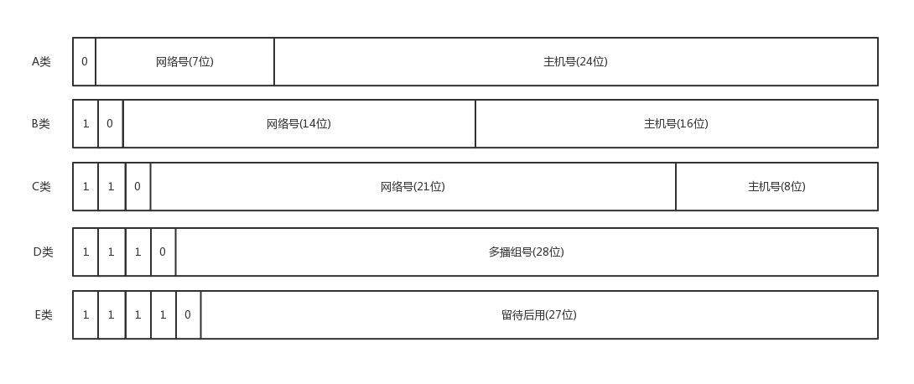
A、B、C类地址分两部分: 前一部分为网络号，后一部分为主机号
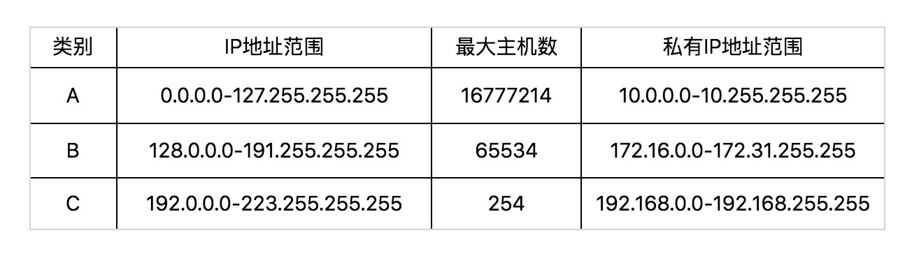

*问题*: C类地址主机数量太少，而B类太多
解决方案: CIDR
### CIDR(无类型域间选路)
将IP地址一分为二，前面是网络号，后面是主机号
例: 10.100.122.2/24, 表示前24位为网络号，后8位为主机号。广播地址为10.100.122.255，子网掩码为255.255.255.0。将IP与子网掩码进行与操作即可得到网络号

### ip addr
输出解析
* UP: 网卡处于启动状态
* BROADCAST: 有广播地址，可以发送广播包
* MULTICAST: 可发送多播
* LOWER_UP: L1 是启动的，即插了网线
* qdisc: queue discipline, 排队规则。有以下几种, pfifo(先进先出), pfifo_fast(队列中包含三个波段band, band 内部先进先出. band 0 最高，band 2 最低, 实际上就是个优先队列)，IP头中的TOS(Type of service)字段可以决定放在哪个队列中

## 第四讲 DHCP与PXE
配置 ip
```sh
ifconfig eth1 10.0.0.1/24
ifconfig eth1 up
# 或
ip addr add 10.0.0.1/24 dev eth1
ip link set up eth1
```
Linux 的默认逻辑：如果是跨网段的，则发送到网关，而不是直接将包发送到网络

### DHCP(动态主机配置协议) 工作方式 
* 新机器(A)发起 DHCP discover
* DHCP server 提供 DHCP Offer
* A选择一个Offer(通常是第一个到达的Offer), 并且发一个广播数据包(DHCP Request)告知所有 DHCP Server 选择了XX, 这样它们可以回收IP
* 被选择的DHCP Server 接到 Request 后返回一个 ACK
**DHCP Request也能用于续租，通常是在租期过去50%的时候**

### PXE(预启动执行环境) 过程
* BIOS启动，并调用 PXE Client(正常启动的话是读取MBR扇区，启动GRUB, GRUB会加载内核和根文件系统的initramfs，这时将权力交给内核)
* PXE Client 发送DHCP 请求
* DHCP Server 分配一个IP, 并在返回IP时告知 PXE Server的地址(next-server)以及文件名字
* PXE Client 用TFTP协议下载镜像，然后执行安装,系统就好了
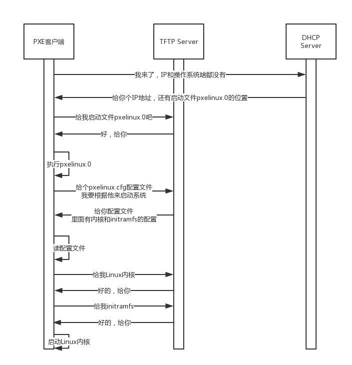

## 第五讲 从物理层到MAC层
* hub: 没有路由功能，所有都是广播
* switch(交换机): 会对包来源进行记忆(转换表)，这样后面有去此源的包就直接发送到该口，避免了广播
### 数据链路层，也即MAC层需要解决的问题
问题：
1. 包的来源和目的
2. 谁先发？谁后发？同时发混乱？
3. 出错怎么办？

方案(多路访问):
1. 信道划分: 各走各的
2. 轮流协议：限号
3. 随机接入协议：堵车就加来，错峰出行。以太网用的就是这个方式
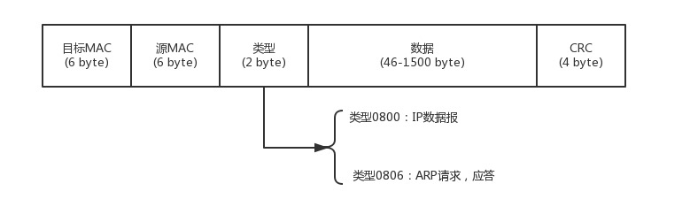
*其中类型表示数据内容，CRC(循环冗余检测)用于校验，解决传输出错的问题*

### POINTS
* MAC层用多路访问来解决堵车问题
* ARP通过广播(吼)的方式来寻找MAC,并会缓存一段时间 
* 交换机有MAC学习功能，学习完后就知道目的，不需要再广播

## 第六讲 交换机与VLAN
* 交换机可能导致环路问题, 解决方案如下
	- STP(Spanning Tree Protocol)， 生成树, 原理类似于比武争夺武林盟主
		* Root Bridge, 根交换机，"掌门"
		* Designated Bridges, 指定交换机, "小弟"
		* Bridge Protocol Data Units(BPDU), 网桥协议数据单元，互相比较实力的协议, 只有"掌门"能发
		* Priority Vector, 优先级向量。一组ID列表，[Root Bridge ID, Root Path Cost, Bridge ID, Port ID]， 实际上就是逐个比较
	- STP 工作过程
		* 开始所有机器都发BPDU(ID由管理员按性能指定，所以有部分机器容易成为"掌门")
		* "比输"的机器自动变为“小弟”，转发BPDU, 这样就形成了很多小门派
		* 接着合并
			- 掌门遇到掌门: 比输的带所有小弟归顺
			- 同门相遇: 掌门遇到不认识的小弟，可能影响优先级; 都是同门小弟相遇，其中之一可能成为上司
			- 掌门与其他帮派小弟相遇: 掌门赢小弟，则小弟归顺，并带连接的兄弟归顺；反之与上同
			- 不同门小弟相遇：输的归顺，并带连接的兄弟归顺
			- 不断重复，最终只有一个盟主胜出

### VLAN 解决广播和安全问题
网络隔离的方式
* 物理隔离: 投入高，不灵活
* 虚拟隔离(VLAN):
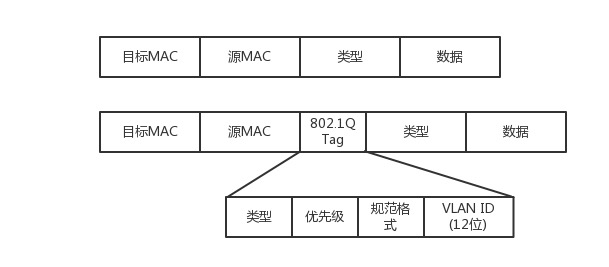
*实际上是mac头部增加Vlan ID用于决定从哪个口去转发*
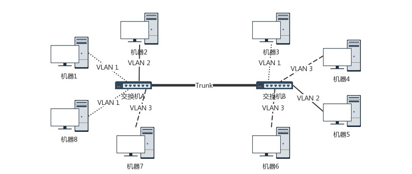
* VLAN间用 trunk口进行转发, 不受VLAN ID限制

## 第七讲 ICMP与ping
ping 基于ICMP(Internet Control Message Protocol, 互联网控制报文协议)协议，
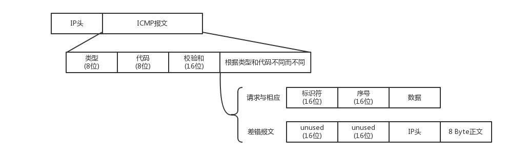
### ICMP类型
* 8: 主动请求
* 0: 主动请求应答
* 差错报文:
	- 3: 终点不可达
	- 4：源抑制, 太快了
	- 5: 重定向 
	- 11: 超时

### ping
ping 发出请求(ICMP ECHO REQUEST), 得到回复(ICMP ECHO REPLY)。
ping 的Request 比原生ICMP多了两个字段: 
- 标识符, 标识包的作用
- 序号，查看质量

### traceroute: 利用差错报文类型
* 设置特殊TTL来追踪去往目的地时沿途经过的路由器
* 故意设置不分片，从而确定MTU

### POINTS
* ICMP相当于网络世界的侦查兵，有主动探查的查询报文和异常报告的差错报文
* ping 使用查询报文，traceroute使用差错报文

## 第八讲 访问外网
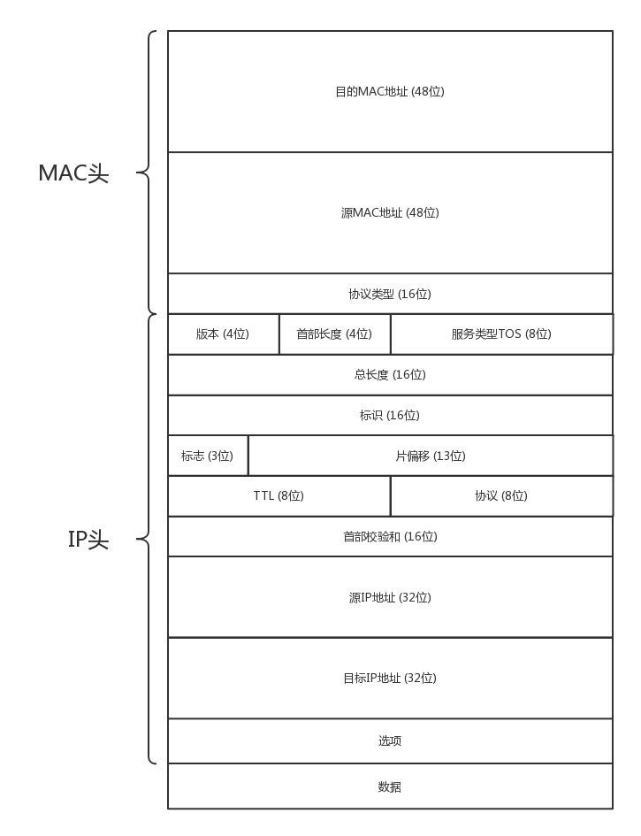
* 判断是不是同一网段(局域网),是则通过ARP直接发送；否则就发往默认网关
* 网关通常是一个路由器，是一个三层转发的设备

网关
- 转发网关: 不改变IP，只改变mac(mac必定改变，因为换了局域网)
- NAT网关: 改变IP

### 欧洲十国游型
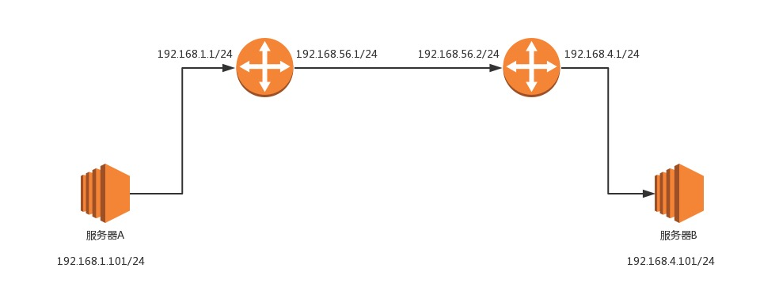
* 每到一个新局域网，IP不变，MAC都要变
* 这种方式的前提是，所有IP段是全局唯一的，不会冲突: 只能用下一种类型

### 玄奘西行型
* NAT: 公网与私网的切换

### POINTS
* 离开局域网需要经过网关，即路由器的一个网口
* 路由器是三层设备，拥有寻找下一跳的规则
* 经过路由器后MAC会变，IP分两种情况，有的变有的不变(可能有IP段冲突)

## 第九讲 路由协议
### 如何配置路由？（路由表）
一条路由规则至少包含以下信息
* 目的网络: 到哪？
* 出口设备：往哪个口发？
* 下一跳网关：下个路由器的地址
*可用route 或者 ip route 命令查询和配置*
```sh
ip route add 10.176.48.0/20 via 10.173.32.1 dev eth0
# 表示要去10.176.48.0/20 这个网络要从 eth0 出去，经过 10.173.32.1
```
*此方法的核心是根据目的IP来配置路由*

### 配置策略路由?
可以根据不同的参数来配置转发策略，如
* 源IP
* 入口设备
* TOS
* etc
```sh
# 以下表示从两个网段来的包分别应用10和20两个路由表的规则
ip rule add from 192.168.1.0/24 table 10
ip rule add from 192.168.2.0/24 table 20
# 以下表示下一跳有2个地方(100...和200...)， 权重分别为1和2
ip route add default scope global \
	nexthop via 100.100.100.1 weight 1 \
	nexthop via 200.200.200.1 weight 2
# 以下命令可以查看当前规则
ip route list table main
```
以下为例子
```sh
# 创建一个路由表 chao
echo 200 chao >> /etc/iproute2/rt_tables
# 添加一条规则, 表示所有从192.168.1.101的查看chao这个路由表
ip rule add from 192.168.1.101 table chao
# 查看
ip rule ls

# 在chao 中添加规则
ip route add default via 60.190.27.189 dev eth3 table chao
ip route flush cache
```

### 动态路由算法: 最短路径算法
#### 距离矢量路由算法(distance vector routing)
* 基于 Bellman-Ford 算法
* 基本思想：每个路由都保存一个路由表, 包含多行，每行表示一个路由器。每行包含两部分信息--目标路由器经过的下一跳、距离目标路由器的距离
* 每个路由都知道全局的信息(有限)：根据邻居路由的表计算自己离目标的距离
* 带来的问题
	- 好消息传递快，坏消息传递慢
	- 每次都要发送整个全局路由表
#### 链路状态路由算法(link state routing)
* 基于 Dijkstra 算法
* 过程
	- 路由A启动时，向邻居发送 say hello, 所有邻居都返回一个回复，除以2就是距离
	- A将自己与邻居间的关系都广播出去，这样所有人都可以在本地构造一个完整的图
	- 对该图应用 Dijkstra 算法, 找到最短路径

#### 现行路由算法
##### OSPF(Open Shortest Path First): 开放式最短路径优先
* 基于链路状态协议,常用于数据中心，也称为内部网关协议(Interior Gateway protocol, IGP)
* 通常会找到多个最短路径, 这些路径可用于负载均衡，常被称为等价路由

##### BGP(Border Gateway Protocol): 外网路由协议
* 基于距离矢量路由算法，使用路径矢量路由算法

##### 为什么外网路由不采用链路状态算法？
* 各国的政策等不一样，形成了一个个自治系统(AS, Autonomous System), 算法效果不好
	- Stub AS: 对外只有一个连接, 通常为个人或者小公司网络，不传输其它AS包
	- Multihomed AS: 有多个连接连接到其他的AS，但大多数拒绝传输其它AS包, 如大公司网络
	- Transit AS: 有多个连接到其它AS网络，并帮助其它AS传输。如主干网
* AS 数量有限，即便全部发送也不会有太大问题

## 第十讲 UDP协议
### UDP vs. TCP
* TCP 提供可靠交付; UDP 继承了IP包的特性：不保证不丢失，不保证顺序到达
* TCP 面向字节流; UDP 面向数据报
* TCP 有拥塞控制; UDP 不提供
* TCP 有状态
### UDP
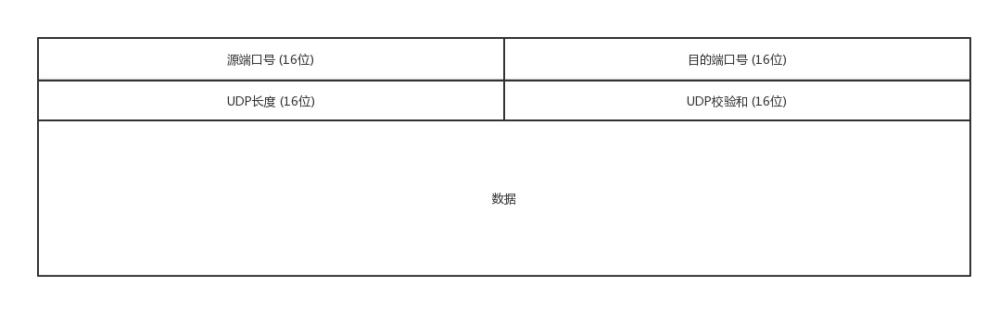
#### UDP 特点
* 沟通简单
* 轻信他人：
* 愣头青，做事不权变

#### UDP 应用场景
* 需要资源少，在网络情况较好的内网，或者对于丢包不敏感的应用, 如DHCP, TFTP等
* 不需要一对一建立连接，可以广播的应用
* 需要处理速度快，时延低，可以容忍少数丢包，但要求即便网络拥塞也继续发送的场景。

#### 基于UDP的常用场景
* QUIC(Quick UDP Internet Connections, 快速UDP互联网连接)
* 流媒体协议: RTMP(直播)
* 实时游戏
* IoT 物联网
* 移动通信：经常断线或者切网，用TCP维护会是个大麻烦

## 第十一讲 TCP协议(上)
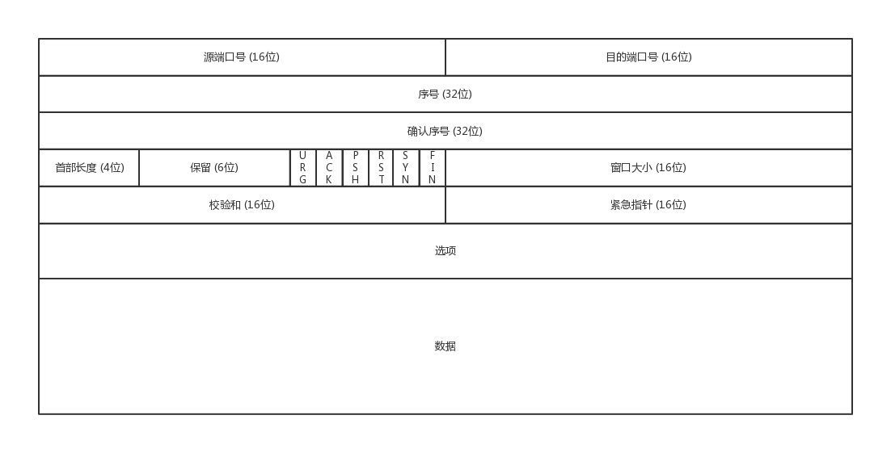

* 顺序问题: 稳重不乱
* 丢包问题：承诺靠谱
* 连接维护：有始有终
* 流量控制：把握分寸
* 拥塞控制：知进知退

### TCP 三次握手
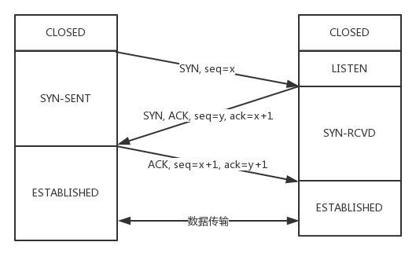
* 为什么是三次？保证双方都有来有回
* 三次握手的作用
	- 建立连接
	- 沟通序号问题：此序号通常4ms加1。为什么不都从1开始？这样可能中间连接断了，再连上时又从1发起的话，网络上的包可能还没消失(TTL)，会引起误会

### TCP 四次挥手
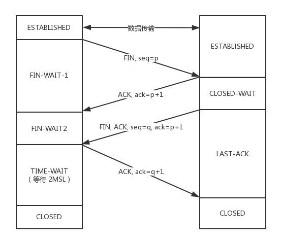
* FIN-WAIT2 状态：如果对方直接没有发FIN，则可能一直存在这个状态，TCP协议并没有对它进行定义，linux 中通常可以调整`tcp_fin_timeout`来设置一个超时时间

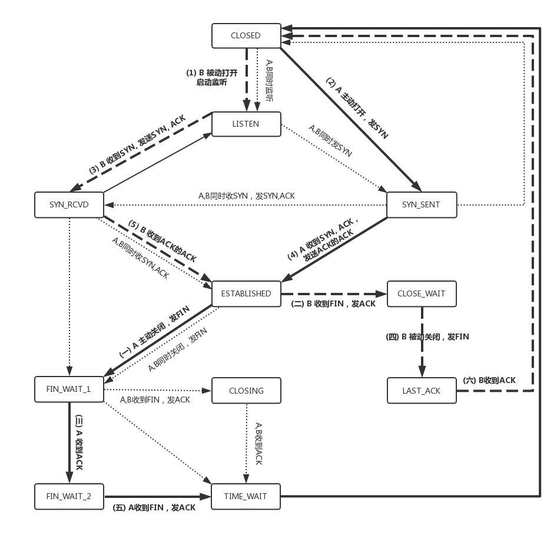

## 第十二讲 TCP协议(下)
### 累计确认或累计应答(cumulative acknowledgment): ACK x收到，说明所有序号小于x的包都收到了
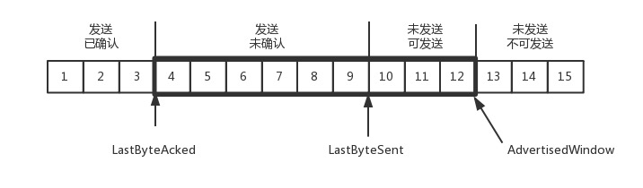
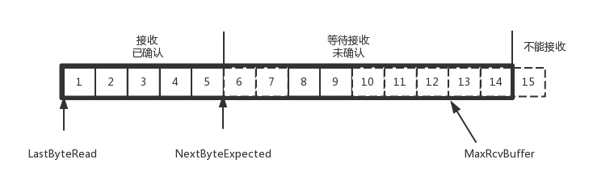
### 重传机制(自适应重传算法)
* 估计往返时间(采样 RTT 的波动范围)
* 超时间隔加倍: 避免拥塞
### 流量控制问题
* 设置窗口大小
### 拥塞控制问题
* 用于避免两种现象: 包丢失和超时重传, 开始时用指数性增长(慢启动)的方式试探
* 问题: 1. 丢包并不代表满负荷了；2. 拥塞控制等到中间设备满了后才发生丢包，降低速度，已经晚了(应该只填通道)
	- 解决方案: TCP BBR 拥塞算法

## 第十三讲 套接字socket
### TCP socket 编程
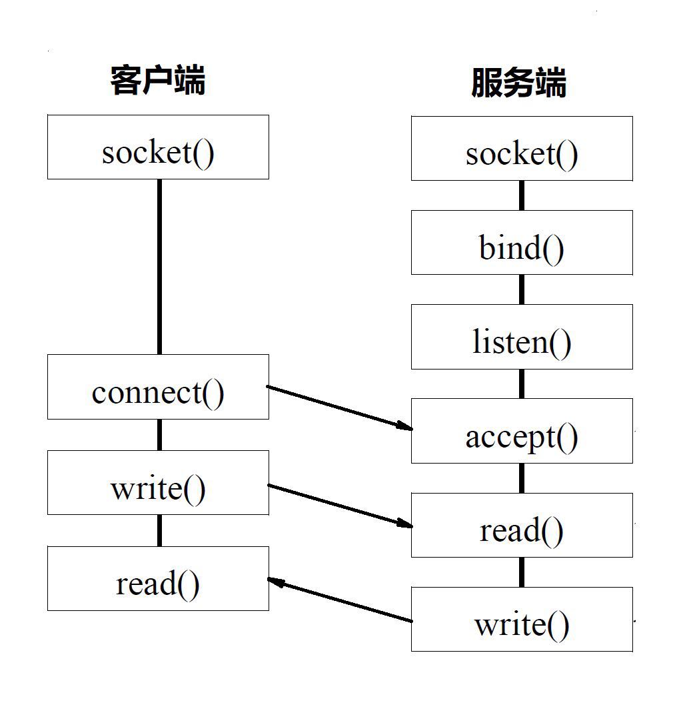
### UDP socket 编程
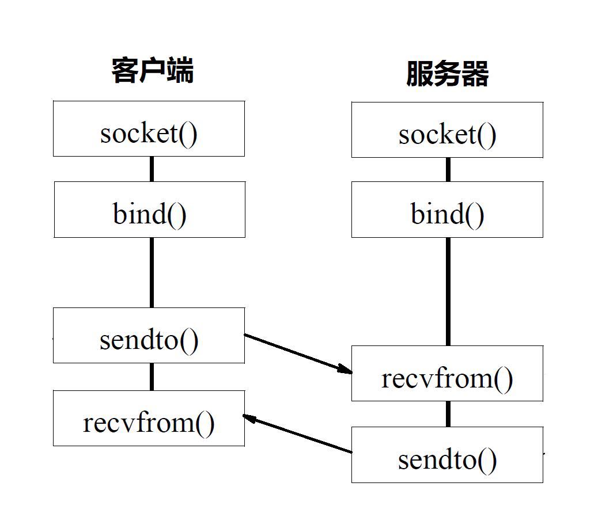

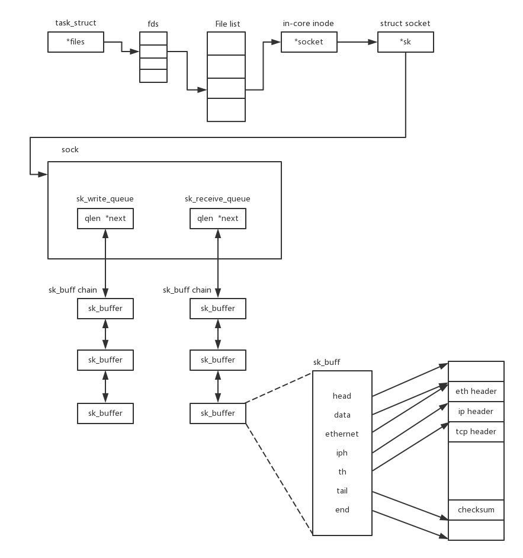
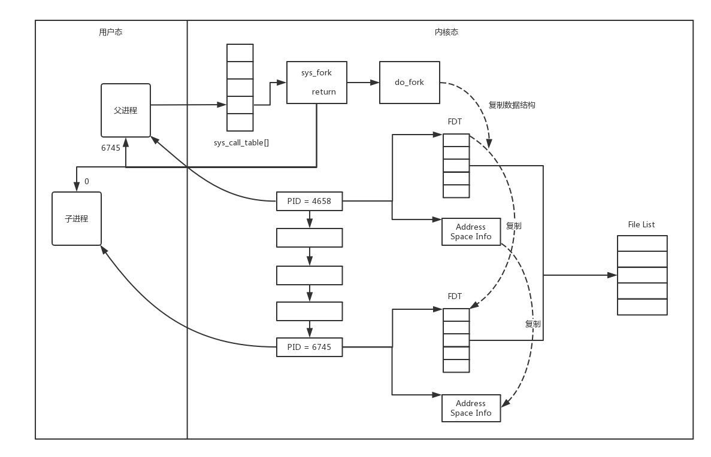
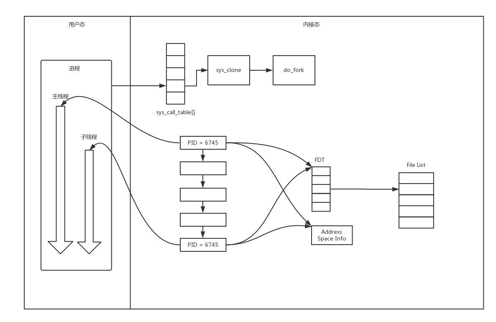

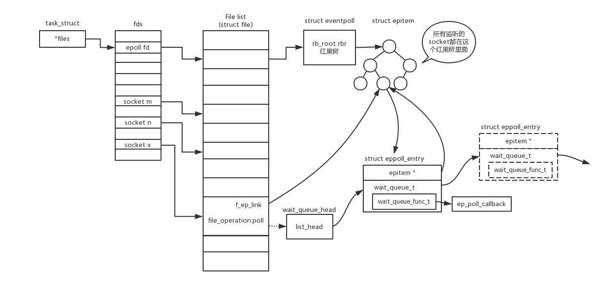
*epoll被称为解决 C10K 问题的利器*

