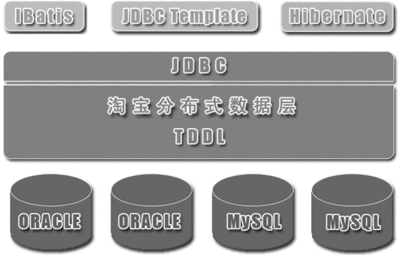
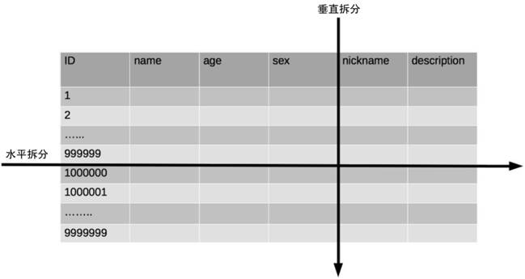

# 01 架构是什么?
[参考](https://time.geekbang.org/column/article/6458)
## 概念梳理
### 系统与子系统
#### 系统
* 关联: 系统是由有关联的个体组成
* 规则: 系统内的个体需要以一定的规则一起动作
* 能力: 系统能力与个体能力有本质的差别，系统能力不是个体能力之和，而是产生了新的能力

#### 模块与组件
*都是系统的组成部分，只是从不同的角度对系统进行拆分*
* 模块: 从逻辑角度进行拆分，如登录注册模块、个人信息模块、个人成绩模块等
* 组件: 从物理(功能)角度进行拆分，如nginx、Web服务器、Mysql等

#### 框架与架构
* 框架：组件规范，如MVC、MVP、J2EE等；框架提供基础功能的产品，如Spring MVC除了满足MVC规范外，还提供了Spring Secruity、Spring JPA等很多基础功能。
* 架构：软件基础结构。软件系统的顶层结构

# 02 架构设计的历史背景
[参考](https://time.geekbang.org/column/article/6463)
## 机器语言(二进制): 1940年前
* 太难写
## 汇编语言：20世纪40年代
* 还是难写
* 各厂商不一致
## 高级语言：20世纪50年代
## 第一次软件危机与结构化程序设计（20 世纪 60 年代~20世纪 70 年代）
* 结构化程序设计方法
## 第二次软件危机与面向对象（20 世纪 80 年代）
* 面向对象程序设计方法

# 03 架构设计的目的
[参考](https://time.geekbang.org/column/article/6472)
## 误区
* 因为架构重要，所以要设计
* 每个系统都要做架构设计
* 公司流程要求
* 为了高性能、高可用、可扩展
## 真正目的
*架构设计的主要目的是为了解决软件系统**复杂度**带来的问题。*
- 心中有数
- 有的放矢，不可贪大求全

# 04 复杂度来源：高性能
[参考](https://time.geekbang.org/column/article/6605)
软件系统中高性能带来的复杂度主要体现在两方面:
* 单台计算机内部为了高性能带来的复杂度
* 多台计算机集群为了高性能带来的复杂度

## 单机复杂度
## 集群复杂度
* 任务分配
* 任务分解
	- 简单的系统更容易做到高性能
	- 可以针对单个任务进行扩展
*任务分解带来的性能收益是有一个度的，并不是任务分解越细越好，而对于架构设计来说，如何把握这个粒度就非常关键了*
## 问题
* 为什么要高性能
追求良好的用户体验；
满足业务增长的需要。
* 如何做好高性能？
	- 垂直维度
		+ 增大内存减少I/O操作
		+ 更换为固态硬盘（SSD）提升I/O访问速度
		+ 使用RAID增加I/O吞吐能力
		+ 置换服务器获得更多的处理器或分配更多的虚拟核
		+ 升级网络接口或增加网络接口
	- 水平维度
		+ 功能分解：基于功能将系统分解为更小的子系统
		+ 多实例副本：同一组件重复部署到多台不同的服务器
		+ 数据分割：在每台机器上都只部署一部分数据

# 05 复杂度来源：高可用
[参考](https://time.geekbang.org/column/article/6895)
*系统的高可用方案五花八门，但万变不离其宗，本质上都是通过“冗余”来实现高可用*
## 与高性能同样增加更多机器来达到目的，但有本质不同
* 高性能增加机器目的在于“扩展”处理性能
* 高可用增加机器目的在于“冗余”处理单元

## 高可用分类
### 计算高可用
*计算的特点:无论在哪台机器上进行计算，同样的算法和输入数据，产出的结果都一样*
### 存储高可用
*存储与计算相比，有一个本质上的区别：将数据从一台机器搬到到另一台机器，需要经过线路进行传输*
*存储高可用的难点不在于如何备份数据，而在于如何减少或者规避数据不一致对业务造成的影响*

#### 分布式领域 CAP 理论
* 存储高可用不可能同时满足“一致性、可用性、分区容错性”，最多满足两个

## 高可用状态决策
*通过冗余来实现的高可用系统，状态决策本质上就不可能做到完全正确*
- 独裁式
- 协商式
	+ 常用的协商式决策为主备决策
- 民主式
	+ ZooKeeper(Paxos)
	+ etcd (raft)

# 06 复杂度来源：可扩展性
[参考](https://time.geekbang.org/column/article/6899)
## 基本条件
* 正确预测变化
* 完美封装变化
## 预测变化
* 不断有新的需求需要实现
* 复杂性在于
	- 不能每个设计点都考虑可扩展性
	- 不能完全不考虑可扩展性
	- 所有的预测都存在出错的可能性

## 应对变化

* 方式一: 将“变化”封装在一个“变化层”，将不变的部分封装在一个独立的“稳定层”
	- 系统需要拆分出变化层和稳定层
	- 需要设计变化层和稳定层之间的接口
* 方式二: 提炼出一个“抽象层”和一个“实现层”
*封装变化，隔离可变性*

# 07 复杂度来源：低成本、安全、规模
[参考](https://time.geekbang.org/column/article/6899)
## 低成本
*往往只有“创新”才能达到低成本目标*
例子:
* NoSQL（Memcache、Redis 等）的出现是为了解决关系型数据库无法应对高并发访问带来的访问压力。
* 全文搜索引擎（Sphinx、Elasticsearch、Solr）的出现是为了解决关系型数据库 like 搜索的低效的问题
* Hadoop 的出现是为了解决传统文件系统无法应对海量数据存储和计算的问题
* Facebook 为了解决 PHP 的低效问题，刚开始的解决方案是 HipHop PHP，可以将 PHP 语言翻译为 C++ 语言执行，后来改为 HHVM，将 PHP 翻译为字节码然后由虚拟机执行，和 Java 的 JVM 类似。
* 新浪微博将传统的 Redis/MC + MySQL 方式，扩展为 Redis/MC + SSD Cache + MySQL 方式，SSD Cache 作为 L2 缓存使用，既解决了MC/Redis 成本过高，容量小的问题，也解决了穿透 DB带来的数据库访问压力
* Linkedin 为了处理每天 5 千亿的事件，开发了高效的Kafka 消息系统。

## 安全
### 功能安全: "防小偷"
* 多与编码相关，与架构关系不大
* 功能安全是一个逐步完善的过程
### 架构安全: "防强盗"
* 传统的架构安全方式
	- 防火墙：隔离网络, 功能强大，但性能一般，主要在传统的银行和企业应用领域应用较多。互联网业务有海量用户和高并发的特点，不适用

*互联网系统架构安全目前没有太好的手段，多是依靠运营商或云服务商强大的带宽和流量清洗能力，较少自己来实现和设计*

## 规模
*量变引起质变*
常见的规模带来的复杂度有:
* 功能越来越多，导致系统复杂度指数级上升
* 数据越来越多，系统复杂度发生质变
	- 以 MySQL 为例，数据量大了后带来的问题
		+ 添加索引很慢(写入)
		+ 修改表结构和添加索引很慢
		+ 索引性能很低
		+ 数据备份时间长
	- 必须拆表，带来的复杂性是
		+ 拆表的规则是什么？
		+ 拆完表后查询如何处理？

# 08 架构设计三原则
[参考](https://time.geekbang.org/column/article/7071)
## 合适原则: 合适优于业界领先
* 人力资源
* 技术积累
* 业务场景
## 简单原则: 简单优于复杂
*软件领域的复杂性体现在两个方面:结构的复杂性;逻辑的复杂性*
## 演化原则: 演化优于一步到位
* 设计出来的架构要满足当时的业务需要
* 架构要不断地在实际应用过程中迭代, 去芜存青，使得架构逐渐完善
* 当业务发生变化时，架构要扩展、重构，甚至重写

# 09 架构设计实例
[参考](https://time.geekbang.org/column/article/7392)
* 淘宝和手机 QQ 作为案例

* 合适原则第一考虑，优先满足业务需求；
* 简单原则第二考虑，挑选简单方案快速落地验证；
* 演进原则第三考虑，适当预测业务发展，感觉预测不准就不预测，等真的出现问题的时候演进即可

# 10 架构设计流程：识别复杂度
[参考](https://time.geekbang.org/column/article/7563)
*将主要的复杂度问题列出来，然后根据业务、技术、团队等综合情况进行排序，优先解决当前面临的最主要的复杂度问题*

# 11 架构设计流程：设计备选方案
[参考](https://time.geekbang.org/column/article/7800)
## 常见错误
* 设计最优秀的方案
	- “合适原则”和“简单原则
* 只做一个方案
	- 可能不全面
	- 经验、知识有局限，或者理解有问题
	- 可能出现过度辩护的情况
* 备选方案过于详细
	- 耗费了大量的时间和精力
	- 注意力集中到细节中，忽略了整体的技术设计
	- 评审的时候其他人会被很多细节给绕进去，评审效果很差
## 设计多个方案
* 3~5个为佳
* 方案间应该有明显差异
* 不要只局限于已熟悉的技术

# 12 架构设计流程：评估和选择备选方案
[参考](https://time.geekbang.org/column/article/7832)
*常见的方案质量属性点有：性能、可用性、硬件成本、项目投入、复杂度、安全性、可扩展性等*
## 360 度环评
列出我们需要关注的质量属性点，然后分别从这些质量属性的维度去评估每个方案，再综合挑选适合当时情况的最优方案
*按优先级选择*

# 13 架构设计流程：详细方案设计
[参考](https://time.geekbang.org/column/article/7885)
## 常见问题
* 假如我们确定使用 Elasticsearch 来做全文搜索，那么就需要确定 Elasticsearch 的索引是按照业务划分，还是一个大索引就可以了；副本数量是 2 个、3 个还是4 个，集群节点数量是 3 个还是 6 个等。
* 假如我们确定使用 MySQL 分库分表，那么就需要确定哪些表要分库分表，按照什么维度来分库分表，分库分表后联合查询怎么处理等
* 假如我们确定引入 Nginx 来做负载均衡，那么 Nginx的主备怎么做，Nginx 的负载均衡策略用哪个（权重分配？轮询？ip_hash？）等。

* Nginx 的负载均衡策略选择
	- 轮询（默认）: 每个请求按时间顺序逐一分配到不同的后端服务器，后端服务器分配的请求数基本一致，如果后端服务器“down 掉”，能自动剔除
	- 加权轮询: 根据权重来进行轮询，权重高的服务器分配的请求更多，主要适应于后端服务器性能不均的情况，如新老服务器混用。
	- ip_hash: 每个请求按访问 IP 的 hash 结果分配，这样每个访客固定访问一个后端服务器，主要用于解决 session 的问题，如购物车类的应用
	- fair: 按后端服务器的响应时间来分配请求，响应时间短的优先分配，能够最大化地平衡各后端服务器的压力，可以适用于后端服务器性能不均衡的情况，也可以防止某台后端服务器性能不足的情况下还继续接收同样多的请求从而造成雪崩效应。
	- url_hash: 按访问 URL 的 hash 结果来分配请求，每个 URL 定向到同一个后端服务器，适用于后端服务器能够将 URL 的响应结果缓存的情况。
*详细设计方案阶段可能遇到的一种极端情况就是在详细设计阶段发现备选方案不可行，一般情况下主要的原因是备选方案设计时遗漏了某个关键技术点或者关键的质量属性*
可用下面方式避免:
- 架构师不但要进行备选方案设计和选型，还需要对备选方案的关键细节有较深入的理解(PPT架构师)
- 通过分步骤、分阶段、分系统等方式，尽量降低方案复杂度
- 如果方案本身就很复杂，那就采取设计团队的方式来进行设计

# 14 高性能数据库集群：读写分离(第一种方式)
[参考](https://time.geekbang.org/column/article/8269)
## 原理: 将数据库读写操作分散到不同的节点上, 分散读写操作的压力

## 基本实现
* 数据库服务器搭建主从集群，一主一从、一主多从都可以
* 数据库主机负责读写操作，从机只负责读操作
* 数据库主机通过复制将数据同步到从机，每台数据库服务器都存储了所有的业务数据
* 业务服务器将写操作发给数据库主机，将读操作发给数据库从机
## 引入的复杂度
### 主从复制延迟
常见的解决方案
* 写操作后的读操作指定发给数据库主服务器
	- 与业务强绑定，不好维护
* 读从机失败后再读一次主机
	- 大量的“二次读取”，对主机压力很大
* 关键业务读写操作全部指向主机，非关键业务采用读写分离
### 分配机制
#### 程序代码封装
* 实现简单，而且可以根据业务做较多定制化的功能
* 每个编程语言都需要自己实现一次，无法通用
* 故障情况下，如果主从发生切换，则可能需要所有系统都修改配置并...
* 例: TDDL(Taobao Distributed Data Layer，外号: 头都大了)

#### 中间件封装
*独立一套系统出来，实现读写操作分离和数据库服务器连接的管理*
* 能够支持多种编程语言，因为数据库中间件对业务服务器提供的是标准 SQL 接口
* 数据库中间件要支持完整的 SQL 语法和数据库服务器的协议, 复杂，需要较长时间才能稳定
* 数据库中间件自己不执行真正的读写操作，但所有的数据库操作请求都要经过中间件，中间件的性能要求也很高
* 数据库主从切换对业务服务器无感知，数据库中间件可以探测数据库服务器的主从状态。例如，向某个测试表写入一条数据，成功的就是主机，失败的就是从机
典型的几个中间件
* Mysql Router

* Atlas(360)

# 15 高性能数据库集群：分库分表(第二种方式)
[参考](https://time.geekbang.org/column/article/8373)
## 原理：分散存储压力
## 数据量加大后产生的问题
* 数据量太大，读写的性能会下降，即使有索引，索引也会变得很大，性能同样会下降
* 数据文件会变得很大，数据库备份和恢复需要耗费很长时间
* 数据文件越大，极端情况下丢失数据的风险越高
## 业务分库：按照业务模块将数据分散到不同的数据库服务器

* join 操作问题
* 事务问题
* 成本问题
基于上述原因，小公司初创业务不适合
* 初创业务存在很大的不确定性，业务不一定能发展起来,业务开始的时候并没有真正的存储和访问压力
* 业务分库后，表之间的 join 查询、数据库事务无法简单实现
* 增加了工作量，而业务初创期间最重要的是快速实现、快速验证，业务分库会拖慢业务节奏
## 分表

### 垂直分表
* 将表中某些不常用且占了大量空间的列拆分出去
### 水平分表
引入更多的复杂性
* 路由: 确定数据属于哪张表
	- 范围路由: 缺点是分布不均匀
	- Hash 路由: 
		+ 优点: 分布均匀
		+ 缺点：扩充新的表很麻烦，所有数据都要重分布
	- 配置路由: 用一张独立的表来记录路由信息
		+ 优点：设计简单，使用起来非常灵活
		+ 缺点：必须多查询一次，会影响整体性能
* join 操作:需要在业务代码或者数据库中间件中进行多次 join 查询，然合并
* count操作: 
	- count() 相加
	- 记录数表
* order by操作: 只能由业务代码或数据库中间件分别查询子表中数据，再进行汇总排序
